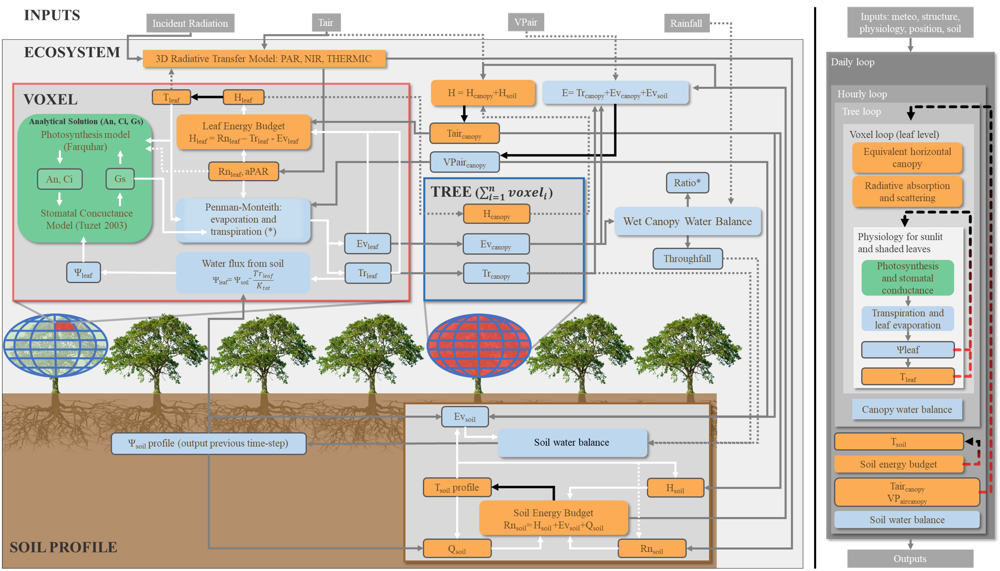

A soil-plant-atmosphere model based on MAESTRA and SPA 
===========================================================================================================================

This version is a customized version of the more officially
distributed version available [here](https://bitbucket.org/remkoduursma/maespa/branch/Vezy_et_al_2018).
It was used to distribute computations using numbered input files, and to adapt the "maestcom" file for using MAESPA with up to 5 species & 5000 trees for use in the Vezy et al. (2018) study.
The original, official version of the model is openly distributed [here](https://maespa.github.io/).

## Changes
Changes relative to the [Vezy_et_al_2018](https://bitbucket.org/remkoduursma/maespa/branch/Vezy_et_al_2018) bitbucket branch:
* Input parameters are now numbered (e.g. 1_confile.dat) for distributed computation
* 5 tree species allowed
* 5000 trees allowed

Changes relative to the official [master](https://bitbucket.org/remkoduursma/maespa/branch/Vezy_et_al_2018) bitbucket branch:
* voxel-scale leaf evaporation
* Computation of canopy air temperature and vapor pressure.
* Iterations on leaf temperature until convergence
* Aerodynamic conductance computation at plot scale (used for soil + canopy air temperature and vapor pressure)
* Allow two wind extinction profile if ZHT (measurement height) is below canopy height (mainly used in agroforestry with measurements below the shade trees)
* Bug fixes on slope computation

## Contributors
Original model maintainers: [Remko Duursma](http://www.remkoduursma.com/) and [Belinda Medlyn](https://bmedlyn.wordpress.com).

This version developpers (alphabetical order): Mathias Christina, Guerric le Maire and Rémi Vezy.  
This version maintainer: Rémi Vezy.

## Guidelines to contribute
If you want to contribute to the development of the MAESPA model, please consider using the official repository first.  
If you still want to develop, use or make any contribution on this project, please feel free to add an [issue](https://gitlab.com/VEZY/MAESPA/issues)

## Compilation
Compiles with:

* Intel Visual Fortran Compiler (version >10).

* gfortran

NB: The Intel Visual Fortran Compiler can lead to much faster executables using optimisations.  
A Makefile is provided to compile Maes* on a Mac or linux-based OS (thanks to Martin de Kauwe and Alejandro Morales).

## Direct downloads
Here are the links to direct download this version executables for Windows [Win x84](https://gitlab.com/VEZY/MAESPA/raw/master/Executables/Windows/maespa_x86.exe)
and [Win x64 ](https://gitlab.com/VEZY/MAESPA/raw/master/Executables/Windows/maespa_x64.exe) and
Linux [CentOS](https://gitlab.com/VEZY/MAESPA/raw/3bcfa81e53840c609f50a7a5d948257cc33a0822/Executables/CentOS/maespa),
[Debian](https://gitlab.com/VEZY/MAESPA/raw/3bcfa81e53840c609f50a7a5d948257cc33a0822/Executables/Debian/maespa) and
[RedHat](https://gitlab.com/VEZY/MAESPA/raw/3bcfa81e53840c609f50a7a5d948257cc33a0822/Executables/RedHat/maespa). Carefull : the Linux executables are no longer updated, please compile MAESPA locally.

## Links to repositories
Here are the links to the official repository on which this version is based on [here](https://bitbucket.org/remkoduursma/maespa/commits/b7440289f6801fbd8841241e48ead6592e58e39e?at=montpellier) and direct download [link](https://bitbucket.org/remkoduursma/maespa/get/montpellier.zip).

## Adapting input files
To adapt the input files from the original version to this version, please consider reading the [wiki](https://gitlab.com/VEZY/MAESPA/wikis/home).

## References
The scientific article can be found on the Agricultural and Forest Meteorology [website](https://www.sciencedirect.com/science/article/pii/S016819231830042X) or [here](https://www.researchgate.net/publication/323398728_Measuring_and_modelling_energy_partitioning_in_canopies_of_varying_complexity_using_MAESPA_model) alternatively.
